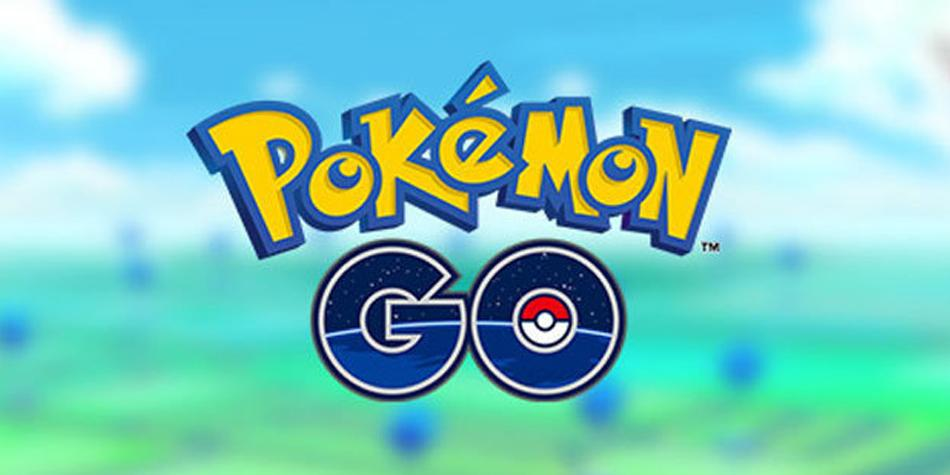

# **InfoPokemon**

Puedes ver el proyecto [aquí]

## **Índice**

* [Preámbulo](#preámbulo)
* [Definición del producto](#definicion-del-producto)
* [Proceso del diseño](#proceso-del-diseño)
* [Planificación del proyecto](#planificacion-del-proyecto)
* [Historias de usuario](#historias-de-usuario)
* [Encuesta](#encuesta)
* [Protitipo baja fidelidad](#prototipo-baja-fidelidad)

## Preámbulo

El presente readme tiene como finalidad documentar el proceso de creación de una aplicación web, además de uso y manejo de data [DataLovers](https://github.com/Laboratoria/SCL009-data-lovers).

## Definición del producto 

Info Pokemón es una aplicación dirigida a todos los jugadores de Pokémon Go. En esta aplicación podrán filtrar y ordena de una manera más rápida y sencilla. 

## Proceso del Diseño 🎨
¿Quiénes son los principales usuarios de producto?

¿Cuáles son los objetivos de estos usuarios en relación con el producto?

¿Cuáles son los datos más relevantes que quieren ver en la interfaz y por qué?

¿Cuándo utilizan o utilizarían el producto?

## Planificación del proyecto 📑

La planificación fué realizada con [Trello](https://trello.com) la puedes encontrar [aquí](https://trello.com/b/QQv7Qxd4/data-lovers)

## Historias de usuario

HU 1  
Como: Jugador de Pokemon.
Quiero : Ver los distintos tipos de huevos que existen.
Para: Coleccionar mejores pokemones.

HU 2
Como: Jugador de Pokemon.
Quiero : Ordenar los distintos tipos de pokemones que existen.
Para: Coleccionar mejores pokemones.

HU 3
Como: Jugador de pokemon.
Quiero : Ver información de las debilidades que tiene cada pokemon.
Para: Poder escoger el mejor pokemon al momento de realizar un combate.

HU 4
Como: Jugador de pokemon.
Quiero : Ver información de los gimnasios y combates.
Para: Poder competir y ganar los combates.

HU 5
Como: Jugador de pokemon.
Quiero : Saber el porcentaje de pokemones por huevos y tipo
Para: Encontrar el de mi preferencia.

### Encuesta 📋

Se realizó una encuesta con el Formulario de Google Forms, con el objetivo de conocer un poco más sobre los jugadores de Pokémon Go recibiendo un total de 73 respuestas.

La encuesta cual se pueden encontrar [aquí](https://docs.google.com/forms/d/e/1FAIpQLSfmEgCpqwzdoIJ9CleUnujALlSSBVGjK6tK0uWzkhkQ_kKF9w/viewform?usp=sf_link)

## Prototipo de baja fidelidad

## Prototipo de alta fidelidad

El prototipo se elaboró con [Figma](https://figma.com) el cual se pueden encontrar [aquí](https://www.figma.com/file/HmIYHbhPacwoAjkGMyFufeRk/POKEMON?node-id=0%3A1)

## **Checklist**

* [X] Usa VanillaJS.
* [X] No hace uso de `this`.
* [X] Pasa linter (`npm pretest`)
* [X] Pasa tests (`npm test`)
* [X] Pruebas unitarias cubren un mínimo del 70% de statements, functions y
  lines y branches.
* [X] Incluye _Definición del producto_ clara e informativa en `README.md`.
* [ ] Incluye historias de usuario en `README.md`.
* [X] Incluye _sketch_ de la solución (prototipo de baja fidelidad) en
  `README.md`.
* [X] Incluye _Diseño de la Interfaz de Usuario_ (prototipo de alta fidelidad)
  en `README.md`.
* [ ] Incluye link a Zeplin en `README.md`.
* [ ] Incluye el listado de problemas que detectaste a través de tests de
  usabilidad en el `README.md`.
* [ ] UI: Muestra lista y/o tabla con datos y/o indicadores.
* [X] UI: Permite ordenar data por uno o más campos (asc y desc).
* [X] UI: Permite filtrar data en base a una condición.
